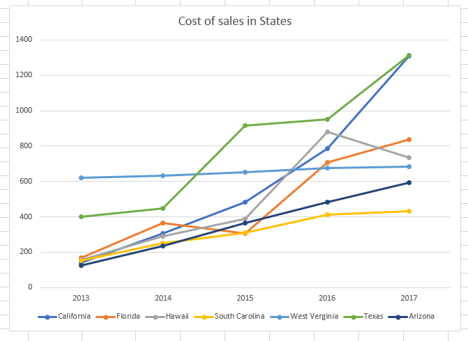
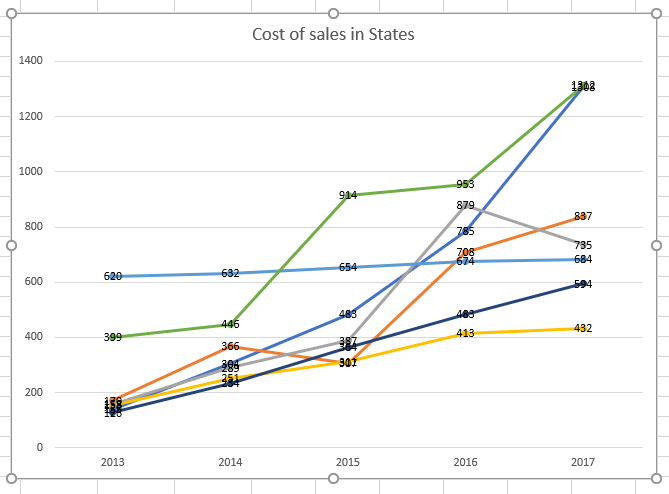

# Use the new Office JavaScript Chart and Events APIs to build an interactive data visualization
This hands-on-lab introduces you to creating an interactive Excel add-in. You will customize chart elements and learn how to instrument event handlers.

## Preparation
This lab is done with Script Lab. Script Lab is an add-in for developing and testing other add-ins. Within Excel, you can test, build, and share your solutions. Script Lab is available from the Add-ins Store.

## 

## Step 1: Setup your sample in Script Lab

You'll prepare Script Lab to code and run your sample. We'll link the correct libraries, write an HTML front-end, and code the program logic in TypeScript. 
Open a blank workbook in Excel to begin. 

Go to the **Script Lab** ribbon tab and select **Code**. Once Script Lab load the pane, select the `+` icon to create a new add-in snippet. That opens a task pane like this one: 
 


### Step 1.1: Use beta libraries

In order to use the new Chart APIs, you need to reference the Office.js beta library and type definitions. Click on the Libraries tab and replace the first two lines with the following:

```
https://appsforoffice.microsoft.com/lib/beta/hosted/office.js
https://appsforoffice.microsoft.com/lib/beta/hosted/office.d.ts
```

### Step 1.2: Create buttons in HTML

You will start with the user interface. The lab sample needs to do four tasks, each of which will become a button:

1. Insert sample data.
2. Create a chart.
3. Register the events with event handlers.
4. Customize the chart. This will be hidden by default and shown when the chart is activated.

This UI is written in HTML. In Script Lab, select the **HTML** tab. Here, you create the four buttons. Replace the contents of the HTML tab with the following:

```html
<b>Step 1: Insert sample data</b>
<p>
<button id="run" class="ms-Button">
    <span class="ms-Button-label">Insert data</span>
</button>
<p>
<b>Step 2: Create a chart</b>
<p>
<button id="create" class="ms-Button">
    <span class="ms-Button-label">Create chart</span>
</button>
<p>
<b>Step 3: Register chart activate/deactivate events</b>
<p>
<button id="register" class="ms-Button">
    <span class="ms-Button-label">Register event</span>
</button>
<p>
<b>Step 4: Show the customize button when chart is activated</b>
<p>
<button id="customize" class="ms-Button" style="display:none">
    <span class="ms-Button-label">Customize chart</span>
</button>
```

### Step 1.3: Add script template

Select the **Script** tab in Script Lab. Replace the text with the following:

```typescript
// TODO-1: Add button click bindings

// TODO-2: Setup up the sample table

// TODO-3: Create the chart

// TODO-4: Adjust the chart data labels

// TODO-5a: Register the chart activated and deactivated events

// TODO-5b: Add event handler logic


/** Default helper for invoking an action and handling errors. */
async function tryCatch(callback) {
    try {
        await callback();
    }
    catch (error) {
        OfficeHelpers.UI.notify(error);
        OfficeHelpers.Utilities.log(error);
    }
}
```

## Step 2: Add the data and chart

### Step 2.1: Bind button clicks

The HTML creates buttons for the user to click. Your script needs to receive and handle those clicks. Replace the `TODO-1` comment with the following code:
to the script using this code

```typescript
$("#run").click(() => tryCatch(run));
$("#create").click(() => tryCatch(createChart));
$("#register").click(() => tryCatch(register));
$("#customize").click(() => tryCatch(customize));
```

### Step 2.2: Insert sample data


This lab uses hard-coded sample data, but the add-in could pull the information from numerous sources. You will insert a table filled with the relevant information.
Replace `TODO-2` with the following code:

```typescript
async function run() {
    await Excel.run(async (context) => {
        let sheet = context.workbook.worksheets.getActiveWorksheet();
        let expensesTable = sheet.tables.add('A1:F1', true);
        expensesTable.getHeaderRowRange().values = [
            ["State", "2013", "2014", "2015", "2016", "2017"]
        ];

        expensesTable.rows.add(null, [
        ["California", 139, 304, 483, 785, 1308],
        ["Florida", 170, 366, 307, 708, 837],
        ["Hawaii", 158, 289, 387, 879, 735],
        ["South Carolina", 153, 251, 311, 413, 432],
        ["West Virginia", 620, 632, 654, 674, 684],
        ["Texas", 399, 446, 914, 953, 1312],
        ["Arizona", 126, 234, 364, 483, 594]]);
        
        await context.sync();

    });
}
```

### Step 2.3 Create a chart



Now, create a chart named "cost" using the sample data. Use the following code to create the chart and set some basic properties.

```typescript
async function createChart() {
    await Excel.run(async (context) => {

        let sheet = context.workbook.worksheets.getActiveWorksheet();
        var chart = sheet.charts.add(Excel.ChartType.lineMarkers, sheet.getRange("A1:F8"), Excel.ChartSeriesBy.rows);
        chart.axes.categoryAxis.setCategoryNames(sheet.getRange("B1:F1"));
        
        chart.title.text = "Cost of sales in States";
        chart.name = "cost";

        chart.width = 485;
        chart.height = 350;
		
        await context.sync();
    });
}
```

### Step 2.4 Customize the chart

Let's give the users an option to customize the chart's data labels after selecting the chart. You'll handle the chart activation events soon, but for now, replace `TODO-4` with the following code:

```typescript
async function customize() {
    await Excel.run(async (context) => {
        let chart = context.workbook.worksheets.getActiveWorksheet().charts.getItem("cost");

        //add data label
        chart.dataLabels.position = "Center";
        chart.dataLabels.separator = "\n";
        chart.dataLabels.format.font.color = "#000000";
    });
}
```

## Step 3: Add event logic

Events allow your add-in to programmatically react to changes to the chart. These changes could come from a user clicking in the worksheet or other add-ins.

You now have a chart based on the sample data. We want an option to customize this chart to appear when the chart is activated. This takes the form of the **Customize chart** button. We also want that button to disappear when the chart is deactivated.

The next few steps create the event handlers and attach them to the chart.

### Step 3.1: Register the event

Charts fire events when activated and deactivated. For our purposes, this will be when a user clicks on the chart using the Excel UI.
First, add the handlers to the chart. These functions are called when the events happen. Replace `TODO-5a` with the following code:

```typescript
async function register(event) {
    await Excel.run(async (context) => {
        let chart = context.workbook.worksheets.getActiveWorksheet().charts.getItem("cost");
        chart.onActivated.add(chartActivated);
        chart.onDeactivated.add(chartDeactivated);
    });
}
```

### Step 3.2: Write the event handlers

Now, implement the functions you attached to the chart. These functions toggle the **Customize chart** button's visibility. Replace `TODO-5b` with the following:

```typescript
async function chartActivated(event) {
    await Excel.run(async (context) => {
        document.getElementById("customize").style.display = "block";
    });
}

async function chartDeactivated(event) {
    await Excel.run(async (context) => {
        document.getElementById("customize").style.display = "none";
    });
}
```

## Step 4: Running the sample

Select the **Run** button on the “Script Lab” ribbon tab.


You should see a Task Pane with the HTML you created in the previous step.


Follow the steps listed in the HTML. Remember to select the chart to see the final button. The resulting chart should look like this after the **Customize chart** button is pressed:



## Next steps
Congratulations! You’ve completed the lab! Please explore the other samples in Script Lab. Click on the menu button and go to **Samples** for more ways to use the power of Excel in your add-ins. 

If you want to learn more about new comming APIs, please view our [Github](https://github.com/OfficeDev/office-js-docs/tree/ExcelJs_OpenSpec) for details.

