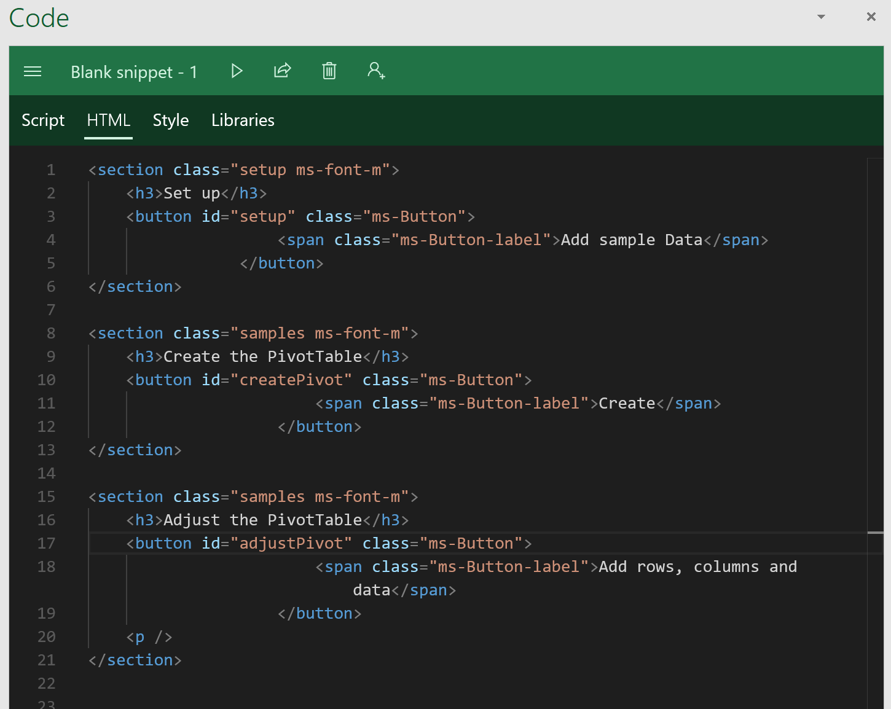

# New in the Excel JavaScript API: Creating Data Analysis Web Add-ins for Excel using Pivot Tables.

During this lab you will learn the basics on how to create pivot tables in Excel using the Excel JavaScript API. You will start by adding some sample data to build a Pivot Table from. The raw data worksheet will look like this: (Hierarchy: Farms with produce either organic or conventional)

## 

## Preparation

On this Hands-on Lab, you will use Script Lab to code and run your snippet. Script Lab is a Web Add-in built by Microsoft that can use to easily  code, run and share your Office.js snippets rapid and conveniently. If you are not familiar with it, you can follow the instructions below.

1.  If you don’t see a “Script Lab” tab on your ribbon, please install it from the store. Otherwise continue to Step 1
2.  Click on the Insert Tab on the ribbon and then select “Get Add-ins” The Office Add-ins dialog will pop up.
3.  In the store tab, search for “Script Lab”, then click on “Add”
4.  At the end of the process you should see the “Script Lab Tab” on the Ribbon.
 Excel
## 

## Step 1 : Setup your snippet in Script Lab

In this exercise, you'll prepare Script Lab to setup your sample basic files, an HTML page and a JavaScript file.

### Step 1.1 Create a new Script Lab Snippet.

Click on the “Code” Button on the Script Lab Ribbon Tab. That will open a task pane like this one:


### Step 1.2 : Setup HTML Page and point to the Office.js BETA end point.

In order to use the Pivot Table API you need to add a reference to the Office.js BETA library.  Click on the Libraries Tab and change the first line so that it points to:

 [https://appsforoffice.microsoft.com/lib/beta/hosted/office.js](https://appsforoffice.microsoft.com/lib/beta/hosted/office.js)

Now let’s click on the HTML Tab and add 3 buttons to a) Insert sample data, b) create Pivot Table and c) add  Rows, columns and data to the Pivot Table. (you can copy/paste from below)

```html
<section class="setup ms-font-m">
    <h3>Set up</h3>
    <button id="setup" class="ms-Button">
        <span class="ms-Button-label">Add sample Data</span>
    </button>
</section>
<section class="samples ms-font-m">
    <h3>Create the PivotTable</h3>
    <button id="createPivot" class="ms-Button">
        <span class="ms-Button-label">Create</span>
    </button>
</section>
<section class="samples ms-font-m">
    <h3>Adjust the PivotTable</h3>
    <button id="adjustPivot" class="ms-Button">
        <span class="ms-Button-label">Add rows, columns and data</span>
    </button>
</section>


```

Your HTML TAB should look like this:


### Step 1.3 : Add  Event handlers for each button.

Now click on the “Script” tab on the Script Lab task pane and add 3 event handlers for each button.

Your code should look like this:

```javascript
$("#setup").click(() => tryCatch(setup));
$("#createPivot").click(() => tryCatch(createPivot));
$("#adjustPivot").click(() => tryCatch(adjustPivot));
async function setup() {
    await Excel.run(async (context) => {
        OfficeHelpers.UI.notify("setup");
        await context.sync();
    });
}
async function createPivot() {
    await Excel.run(async (context) => {
        OfficeHelpers.UI.notify("create");
        await context.sync();
    });
}
async function adjustPivot() {
    await Excel.run(async (context) => {
        OfficeHelpers.UI.notify("adjust");
        await context.sync();
    });
}
/** Default helper for invoking an action and handling errors. */
async function tryCatch(callback) {
    try {
        await callback();
    }
    catch (error) {
        OfficeHelpers.UI.notify(error);
        OfficeHelpers.Utilities.log(error);
    }
}
```
## Step  2: Create your Pivot Table.

Step 2.1 Add Code to insert sample data  setup method (copy paste).


```javascript

async function setup() {
    await Excel.run(async (context) => {
        const sheetData = await OfficeHelpers.ExcelUtilities
            .forceCreateSheet(context.workbook, "Data");
        const sheetPivot = await OfficeHelpers.ExcelUtilities
            .forceCreateSheet(context.workbook, "Pivot");

        const data = [["Farm", "Type", "Classification", "Crates Sold at Farm", "Crates Sold Wholesale"],
        ["A Farms", "Lime", "Organic", 300, 2000],
        ["A Farms", "Lemon", "Organic", 250, 1800],
        ["A Farms", "Orange", "Organic", 200, 2200],
        ["B Farms", "Lime", "Conventional", 80, 1000],
        ["B Farms", "Lemon", "Conventional", 75, 1230],
        ["B Farms", "Orange", "Conventional", 25, 800],
        ["B Farms", "Orange", "Organic", 20, 500],
        ["B Farms", "Lemon", "Organic", 10, 770],
        ["B Farms", "Kiwi", "Conventional", 30, 300],
        ["B Farms", "Lime", "Organic", 50, 400],
        ["C Farms", "Apple", "Organic", 275, 220],
        ["C Farms", "Kiwi", "Organic", 200, 120],
        ["D Farms", "Apple", "Conventional", 100, 3000],
        ["D Farms", "Apple", "Organic", 80, 2800],
        ["E Farms", "Lime", "Conventional", 160, 2700],
        ["E Farms", "Orange", "Conventional", 180, 2000],
        ["E Farms", "Apple", "Conventional", 245, 2200],
        ["E Farms", "Kiwi", "Conventional", 200, 1500],
        ["F Farms", "Kiwi", "Organic", 100, 150],
        ["F Farms", "Lemon", "Conventional", 150, 270]];

        const range = sheetData.getRange("A1:E21");
        range.values = data;
        range.format.autofitColumns();

        sheetPivot.activate();

        await context.sync();
    });
}
```

Step 2.2 Add Code to create a Pivot Table.

```javascript
async function createPivot() {
    await Excel.run(async (context) => {
        const rangeToAnalyze = context.workbook.worksheets.getItem("Data").getRange("A1:E21");
        const rangeToPlacePivot = context.workbook.worksheets.getItem("Pivot").getRange("A2");
        context.workbook.worksheets.getItem("Pivot").pivotTables.add("Farm Sales", rangeToAnalyze, rangeToPlacePivot);

        await context.sync();
    });
}
```

Step 2.3 Add Code to add rows, columns and data hierarchies.

```javascript
async function adjustPivot() {
    await Excel.run(async (context) => {

        await Excel.run(async (context) => {
            const pivotTable = context.workbook.worksheets.getActiveWorksheet().pivotTables.getItem("Farm Sales");

            //add row hierarchies!
            pivotTable.rowHierarchies.add(pivotTable.hierarchies.getItem("Farm"));
            pivotTable.rowHierarchies.add(pivotTable.hierarchies.getItem("Type"));

            // add column hierarchies ! 
            let myColumnHierarchy = pivotTable.hierarchies.getItem("Classification");
            pivotTable.columnHierarchies.add(myColumnHierarchy);

            // add values ! 
            let myValue = pivotTable.dataHierarchies.add(pivotTable.hierarchies.getItem("Crates Sold at Farm"));
            myValue.summarizeBy = Excel.AggregationFunction.sum;

            await context.sync();
        });
    });
}
```

## Step 4: Run your sample!

Click on the RUN tab on “Script Lab”


You should see a Task Pane with the HTML you created in the previous step.


Click the buttons in top/down order and you will see a pivot table like this one:


Summary: in this Lab you learned the basics on how to build a pivot table to summarize data.
