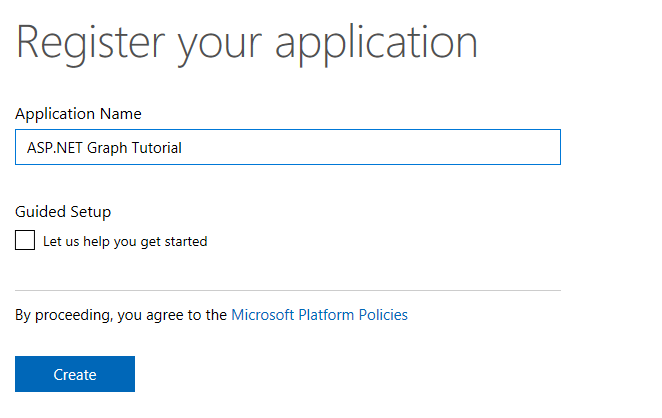
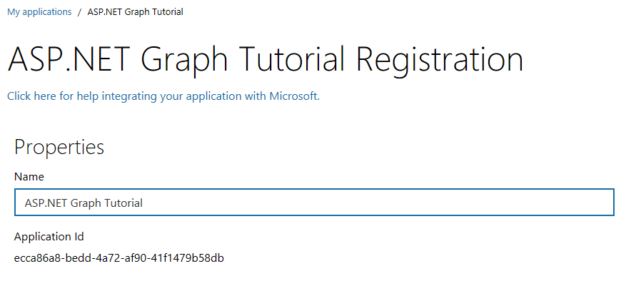
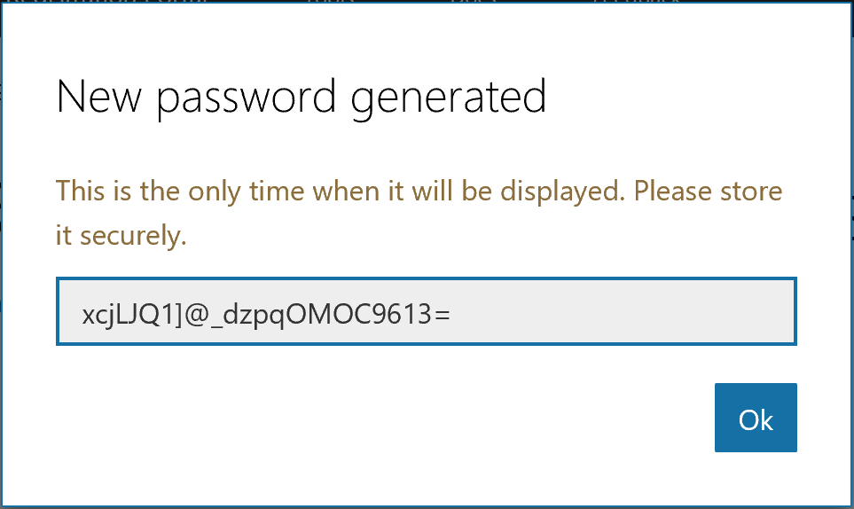
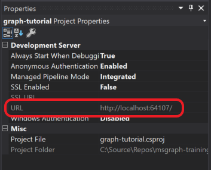
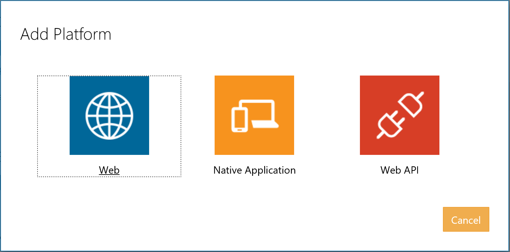
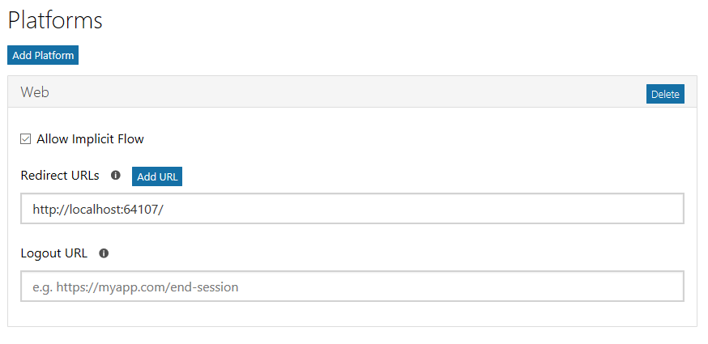

# Build ASP.NET MVC apps with Microsoft Graph

In this lab you will create an ASP.NET MVC application, configured with Azure Active Directory (Azure AD) for authentication & authorization using the Microsoft Authentication Library (MSAL) & OWIN middleware, that accesses data in Office 365 using the Microsoft Graph .NET SDK.

## In this lab

- [Register a web application with the Application Registration Portal](#exercise-2-register-a-web-application-with-the-application-registration-portal)
- [Extend the app for Microsoft Graph](#exercise-4-extend-the-app-for-microsoft-graph)


## Exercise 1: Register a web application with the Application Registration Portal

In this exercise, you will create a new Azure AD web application registration using the Application Registry Portal (ARP).

1. Open a browser and navigate to the [Application Registration Portal](https://apps.dev.microsoft.com). Login using a **personal account** (aka: Microsoft Account) or **Work or School Account**.

1. Select **Add an app** at the top of the page.

    > **Note:** If you see more than one **Add an app** button on the page, select the one that corresponds to the **Converged apps** list.

1. On the **Register your application** page, set the **Application Name** to **ASP.NET Graph Tutorial** and select **Create**.

    

1. On the **ASP.NET Graph Tutorial Registration** page, under the **Properties** section, copy the **Application Id** as you will need it later.

    

1. Scroll down to the **Application Secrets** section.

    1. Select **Generate New Password**.
    1. In the **New password generated** dialog, copy the contents of the box as you will need it later.

        > **Important:** This password is never shown again, so make sure you copy it now.

    

1. Determine your ASP.NET app's URL. In Visual Studio's Solution Explorer, select the **graph-tutorial** project. In the **Properties** window, find the value of **URL**. Copy this value.

    

1. Scroll down to the **Platforms** section.

    1. Select **Add Platform**.
    1. In the **Add Platform** dialog, select **Web**.

        

    1. In the **Web** platform box, enter the URL you copied from the Visual Studio project's properties for the **Redirect URLs**.

        

1. Scroll to the bottom of the page and select **Save**.

## Exercise 2: Extend the app for Azure AD Authentication

In this exercise you will extend the application from the previous exercise to support authentication with Azure AD. This is required to obtain the necessary OAuth access token to call the Microsoft Graph. In this step you will integrate the OWIN middleware and the [Microsoft Authentication Library](https://www.nuget.org/packages/Microsoft.Identity.Client/) library into the application.

Right-click the **graph-tutorial** project in Solution Explorer and choose **Add > New Item...**. Choose **Web Configuration File**, name the file `PrivateSettings.config` and choose **Add**. Replace its entire contents with the following code.

```xml
<appSettings>
    <add key="ida:AppID" value="YOUR APP ID" />
    <add key="ida:AppSecret" value="YOUR APP PASSWORD" />
    <add key="ida:RedirectUri" value="http://localhost:64107/" />
    <add key="ida:AppScopes" value="openid email profile offline_access     User.Read Calendars.Read" />
</appSettings>
```

Replace `YOUR APP ID HERE` with the application ID from the Application Registration Portal, and replace `YOUR APP SECRET HERE` with the password you generated. Also be sure to modify the value for the `ida:RedirectUri` to match your application's URL.

> **Important:** If you're using source control such as git, now would be a good time to exclude the `PrivateSettings.config` file from source control to avoid inadvertently leaking your app ID and password.

Restart the server and go through the sign-in process. You should end up back on the home page, but the UI should change to indicate that you are signed-in.


Click the user avatar in the top right corner to access the **Sign Out** link. Clicking **Sign Out** resets the session and returns you to the home page.


## Exercise 3: Extend the app for Microsoft Graph

In this exercise you will incorporate the Microsoft Graph into the application. For this application, you will use the [Microsoft Graph Client Library for .NET](https://github.com/microsoftgraph/msgraph-sdk-dotnet) to make calls to Microsoft Graph.

### Get calendar events from Outlook

Start by extending the `GraphHelper` class you created in the last module. First, add the following `using` statements to the top of the `Helpers/GraphHelper.cs` file.

```cs
using graph_tutorial.TokenStorage;
using Microsoft.Identity.Client;
using System.Collections.Generic;
using System.Configuration;
using System.Linq;
using System.Security.Claims;
using System.Web;
```

Then add the following code to the `GraphHelper` class.

```cs
// Load configuration settings from PrivateSettings.config
private static string appId = ConfigurationManager.AppSettings["ida:AppId"];
private static string appSecret = ConfigurationManager.AppSettings["ida:AppSecret"];
private static string redirectUri = ConfigurationManager.AppSettings["ida:RedirectUri"];
private static string graphScopes = ConfigurationManager.AppSettings["ida:AppScopes"];

public static async Task<IEnumerable<Event>> GetEventsAsync()
{
    var graphClient = GetAuthenticatedClient();

    var events = await graphClient.Me.Events.Request()
        .Select("subject,organizer,start,end")
        .OrderBy("createdDateTime DESC")
        .GetAsync();

    return events.CurrentPage;
}

private static GraphServiceClient GetAuthenticatedClient()
{
    return new GraphServiceClient(
        new DelegateAuthenticationProvider(
            async (requestMessage) =>
            {
                // Get the signed in user's id and create a token cache
                string signedInUserId = ClaimsPrincipal.Current.FindFirst(ClaimTypes.NameIdentifier).Value;
                SessionTokenStore tokenStore = new SessionTokenStore(signedInUserId,
                    new HttpContextWrapper(HttpContext.Current));

                var idClient = new ConfidentialClientApplication(
                    appId, redirectUri, new ClientCredential(appSecret),
                    tokenStore.GetMsalCacheInstance(), null);

                // By calling this here, the token can be refreshed
                // if it's expired right before the Graph call is made
                var result = await idClient.AcquireTokenSilentAsync(
                    graphScopes.Split(' '), idClient.Users.First());

                requestMessage.Headers.Authorization =
                    new AuthenticationHeaderValue("Bearer", result.AccessToken);
            }));
}
```

Consider what this code is doing.

- The `GetAuthenticatedClient` function initializes a `GraphServiceClient` with an authentication provider that calls `AcquireTokenSilentAsync`.
- In the `GetEventsAsync` function:
  - The URL that will be called is `/v1.0/me/events`.
  - The `Select` function limits the fields returned for each events to just those the view will actually use.
  - The `OrderBy` function sorts the results by the date and time they were created, with the most recent item being first.

Now create a controller for the calendar views. Right-click the **Controllers** folder in Solution Explorer and choose **Add > Controller...**. Choose **MVC 5 Controller - Empty** and choose **Add**. Name the controller `CalendarController` and choose **Add**. Replace the entire contents of the new file with the following code.

```cs
using graph_tutorial.Helpers;
using System.Threading.Tasks;
using System.Web.Mvc;

namespace graph_tutorial.Controllers
{
    public class CalendarController : BaseController
    {
        // GET: Calendar
        [Authorize]
        public async Task<ActionResult> Index()
        {
            var events = await GraphHelper.GetEventsAsync();
            return Json(events, JsonRequestBehavior.AllowGet);
        }
    }
}
```

Now you can test this. Start the app, sign in, and click the **Calendar** link in the nav bar. If everything works, you should see a JSON dump of events on the user's calendar.

### Display the results

Now you can add a view to display the results in a more user-friendly manner. In Solution Explorer, right-click the **Views/Calendar** folder and choose **Add > View...**. Name the view `Index` and choose **Add**. Replace the entire contents of the new file with the following code.

```html
@model IEnumerable<Microsoft.Graph.Event>

@{
    ViewBag.Current = "Calendar";
}

<h1>Calendar</h1>
<table class="table">
    <thead>
        <tr>
            <th scope="col">Organizer</th>
            <th scope="col">Subject</th>
            <th scope="col">Start</th>
            <th scope="col">End</th>
        </tr>
    </thead>
    <tbody>
        @foreach (var item in Model)
        {
            <tr>
                <td>@item.Organizer.EmailAddress.Name</td>
                <td>@item.Subject</td>
                <td>@Convert.ToDateTime(item.Start.DateTime).ToString("M/d/yy h:mm tt")</td>
                <td>@Convert.ToDateTime(item.End.DateTime).ToString("M/d/yy h:mm tt")</td>
            </tr>
        }
    </tbody>
</table>
```

That will loop through a collection of events and add a table row for each one. Remove the `return Json(events, JsonRequestBehavior.AllowGet);` line from the `Index` function in `Controllers/CalendarController.cs`, and replace it with the following code.

```cs
return View(events);
```

Start the app, sign in, and click the **Calendar** link. The app should now render a table of events.


